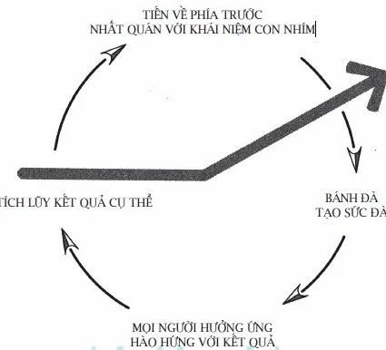
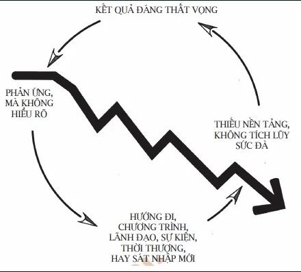

## C8: Bánh đà và vòng lẩn quẩn
Khái niệm hiệu ứng bánh đà: nói về sự đồng thuận và hòa hợp trong việc quản lý sự thay đổi. Mô hình này thường được áp dụng trong công ty nhảy vọt

Vòng luẩn quẩn: mô tả việc các công ty ngược lại với công ty nhảy vọt thực hiện các biện pháp cải tiến, bằng cách sử dụng những chương trình hoành tráng,
những cuộc cách tân mạnh mẽ, v.v mà bỏ qua quá trình xây dựng nền tảng và muốn tiến ngay đến bước nhảy vọt. 

Họ thường đẩy bánh đà đi nhiều hướng khác nhau nên không tạo ra được sức đà bền vững và rơi vào vòng luẩn quẩn

